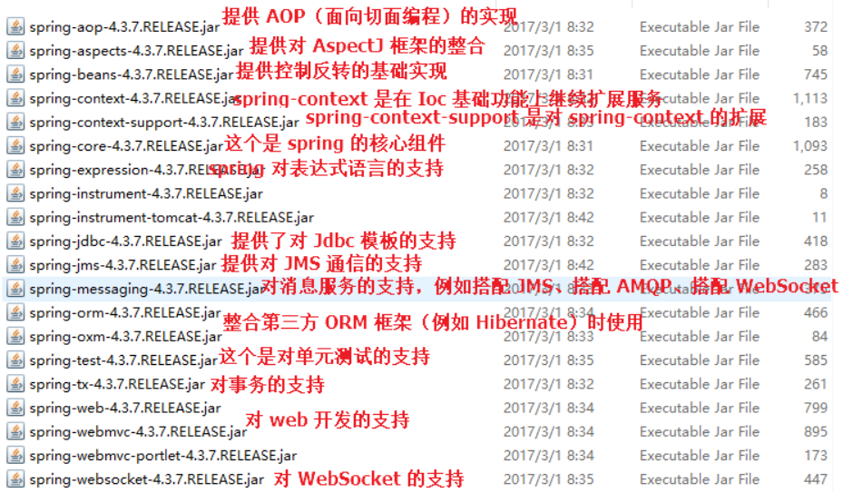

### springboot notes
 
#### 1- getBean() using name instead of class
```
public class Main {
    public static void main(String[] args) {
        ClassPathXmlApplicationContext ctx = new ClassPathXmlApplicationContext("applicationContext.xml");
        //FileSystemXmlApplicationContext ctx = new FileSystemXmlApplicationContext("F:\\workspace5\\workspace\\spring\\spring-ioc\\src\\main\\resources\\applicationContext.xml"); 
        Book book = (Book) ctx.getBean("book"); //Instead of Book book = ctx.getBean(Book.class) to avoid conflicting two beans of same class
        System.out.println(book);
    }
} 
```

#### 2- Use factory method to inject a builder that doesn't have a constructor

```
//use static factory
public class OkHttpUtils {
    private static OkHttpClient OkHttpClient;
    public static synchronized OkHttpClient getInstance() {
        if (OkHttpClient == null) {
            OkHttpClient = new OkHttpClient.Builder().build();
        }
        return OkHttpClient;
    }
}

<bean class="org.javaboy.OkHttpUtils" factory-method="getInstance" id="okHttpClient"></bean>
OkHttpClient okHttpClient = ctx.getBean("okHttpClient", OkHttpClient.class);
```
Use @Autowired, @Resources, @Injected to inject bean. 

#### 3- bean registration to spring context
 
a. xml 

_ignore_

b. @Configuration annotation
```
@Configuration // same as applicationContext.xml
public class JavaConfig {
    @Bean
    SayHello sayHello() {
        return new SayHello();
    }
}
public class Main {
    public static void main(String[] args) {
        AnnotationConfigApplicationContext ctx = new AnnotationConfigApplicationContext(JavaConfig.class); // load configuration
        SayHello hello = ctx.getBean(SayHello.class);
        System.out.println(hello.sayHello("javaboy"));
    }
}

//to have both xml and annotation
@Configuration
@ImportResource("classpath:applicationContext.xml")
public class JavaConfig {
}
```
c. auto-config using @Service, @Component, @Repository 
```
@Configuration
@ComponentScan(basePackages = "org.javaboy.javaconfig.service")
public class JavaConfig {
}

//
<context:component-scan base-package="org.javaboy.javaconfig"/>
```


#### 4- ContextAware
to get context in bean
```
@Component
public class SayHello implements ApplicationContextAware {
    private ApplicationContext applicationContext;
    public String sayHello(String name) {
        //判断容器中是否存在某个 Bean
        boolean userDao = applicationContext.containsBean("userDao333");
        System.out.println(userDao);
        return "hello " + name;
    }
    @Override
    public void setApplicationContext(ApplicationContext applicationContext) throws BeansException {
        this.applicationContext = applicationContext;
    }
}
```

#### 5. AOP
 
JDK Dynamic Proxy which needs interface vs cglib  

Force spring to use CGLib proxy instead, which proxies using subclassing, by setting proxyTargetClass=true in @EnableTransactionManagement annotation.




